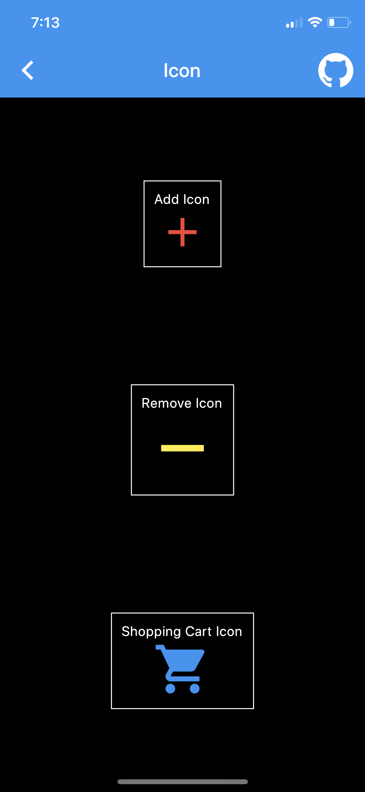

# widget_learner

A flutter project to try out widgets in flutter

## Getting Started

This project is a starting point for a Flutter application.

A few resources to get you started if this is your first Flutter project:

- [Lab: Write your first Flutter app](https://flutter.dev/docs/get-started/codelab)
- [Cookbook: Useful Flutter samples](https://flutter.dev/docs/cookbook)

For help getting started with Flutter, view our
[online documentation](https://flutter.dev/docs), which offers tutorials,
samples, guidance on mobile development, and a full API reference.

## List of Widgets

1. [Basic Widgets](lib/views/basic_views)

    1. [Scaffold](lib/views/basic_views/scaffold_views)
        1. [Simple Scaffold](lib/views/basic_views/scaffold_views/simple_scaffold_view.dart)
        2. [Scaffold with AppBar](lib/views/basic_views/scaffold_views/scaffold_with_app_bar_view.dart)
        3. [Scaffold with Body](lib/views/basic_views/scaffold_views/scaffold_with_body_view.dart)
        4. [Scaffold with Floating Actions Button](lib/views/basic_views/scaffold_views/scaffold_with_button_view.dart)
        
    2. [AppBar](lib/views/basic_views/app_bar_views)
        1. [Simple AppBar](lib/views/basic_views/app_bar_views/simple_app_bar_view.dart)
        2. [AppBar with Title](lib/views/basic_views/app_bar_views/app_bar_title_view.dart)
        3. [AppBar with Actions](lib/views/basic_views/app_bar_views/app_bar_actions_view.dart)
        4. [AppBar with Elevation](lib/views/basic_views/app_bar_views/app_bar_elevation_view.dart)

    3. [Center](lib/views/basic_views/center_views/center_view.dart)
        
        

    4. [Container](lib/views/basic_views/container_views)
        1. [Simple Container](lib/views/basic_views/container_views/simple_container_view.dart)
        2. [Contianer with Border](lib/views/basic_views/container_views/container_border_view.dart)
        3. [Container with Shadow](lib/views/basic_views/container_views/container_shadow_view.dart)
            
        4. [Container with Alignment Property](lib/views/basic_views/container_views/container_align_view.dart)
        5. [Container with Different Border Property](lib/views/basic_views/container_views/container_rounded_borders_view.dart)
            
    
    5. [Coulmn](lib/views/basic_views/column_views)
        1. [Simple Column](lib/views/basic_views/column_views/simple_column_view.dart)
        2. [Simple Column with Different Widgets](lib/views/basic_views/column_views/different_column_view.dart)
            
        3. [Space Evenly Column](lib/views/basic_views/column_views/space_evenly_column_view.dart)
        4. [Space Between Column](lib/views/basic_views/column_views/space_between_column_view.dart)
        5. [Space Around Column](lib/views/basic_views/column_views/space_around_column_view.dart)
        6. [Column with Nested Row](lib/views/basic_views/column_views/column_with_row_view.dart)
            
    
    6. [Row](lib/views/basic_views/row_views)
        1. [Simple Row](lib/views/basic_views/row_views/simple_row_view.dart)
        2. [Simple Row with Different Widgets](lib/views/basic_views/row_views/different_row_view.dart)
            
        3. [Space Evenly Row](lib/views/basic_views/row_views/space_evenly_row_view.dart)

        4. [Space Between Row](lib/views/basic_views/row_views/space_between_row_view.dart)
        5. [Space Around Row](lib/views/basic_views/row_views/space_around_row_view.dart)
        6. [Row with Nested Column](lib/views/basic_views/row_views/column_with_row_view.dart)
            
    
    7. [Icon](lib/views/basic_views/icon_views/icon_view.dart)
        
    
    8. [Image](lib/views/basic_views/image_views/image_view.dart)
        
    
    9. [RaisedButton](lib/views/basic_views/raised_button_views/raised_button_view.dart)
        
    
    10. [Text](lib/views/basic_views/text_views/text_view.dart)
        

2. [App Structure & Navigation](lib/views/app_structure_views)

    1. [Bottom Navigation Drawer](lib/views/app_structure_views/bottom_navigation_bar_views/bottom_navigation_bar_view.dart)
        
    
    2. [Drawer](lib/views/app_structure_views/drawer_views/drawer_view.dart)
        
    
    3. [Sliver App Bar](lib/views/app_structure_views/sliver_app_bar_views/sliver_app_bar_view.dart)
        
    
    4. [Tab Bar](lib/views/app_structure_views/tab_bar_views/tab_bar_view.dart)
        

3. [Buttons](lib/views/button_views)

    1. [Button Bar](lib/views/button_views/button_bar_views/button_bar_view.dart)
        

    2. [Dropdown Button](lib/views/button_views/dropdown_button_views/dropdown_button_view.dart)
        

    3. [Flat Button](lib/views/button_views/flat_button_views/flat_button_view.dart)
        
    
    4. [Floating Action Button](lib/views/button_views/floating_action_button_views/floating_action_button_view.dart)
        
    
    5. [Icon Button](lib/views/button_views/icon_button_views/icon_button_view.dart)
        

    6. [Outline Button](lib/views/button_views/outline_button_views/outline_button_view.dart)
        
    
    7. [Popup Menu Button](lib/views/button_views/popup_menu_button_views/popup_menu_button_view.dart)
        
        
4. [Input and Selections](lib/views/input_views)

    1. [Checkbox](lib/views/input_views/checkbox_views/checkbox_view.dart)
        
    
    2. [Date & Time Picker](lib/views/input_views/date_time_picker_views/date_time_picker_view.dart)
        
        
    
    3. [Radio](lib/views/input_views/radio_views/radio_view.dart)
        
    
    4. [Slider](lib/views/input_views/slider_views/slider_view.dart)
        
    
    5. [Switch](lib/views/input_views/switch_views/switch_view.dart)
        
    
    6. [TextField](lib/views/input_views/text_field_views/text_field_view.dart)
        

5. [Dialogs, Alerts & Panels](lib/views/dialog_views)

    1. [AlertDialog](lib/views/dialog_views/alert_dialog_views/alert_dialog_view.dart)
        
        
    
    2. [BottomSheet](lib/views/dialog_views/bottom_sheet_views/bottom_sheet_view.dart)
        
    
    3. [SnackBar](lib/views/dialog_views/snack_bar_views/snack_bar_view.dart)
        

6. [Information Displays](lib/views/information_views)
    
    1. [Card](lib/views/information_views/card_views/card_view.dart)
        
    
    2. [Chip](lib/views/information_views/chip_views/chip_view.dart)
        
    
    3. [CircularProgressIndicator](lib/views/information_views/circular_progress_indicator_views/circular_progress_indicator_view.dart)
        
    
    4. [DataTable](lib/views/information_views/data_table_views/data_table_view.dart)
        
    
    5. [GridView](lib/views/information_views/grid_view_views/grid_view_view.dart)
        
    
    6. [LinearProgressIndicator](lib/views/information_views/linear_progress_indicator_views/linear_progress_indicator_view.dart)
        
    
    7. [Tooltip](lib/views/information_views/tooltip_views/tooltip_view.dart)

7. [Layout](lib/views/layout_views)

    1. [Divider](lib/views/layout_views/divider_views/divider_view.dart)
        
    
    2. [ListTile](lib/views/layout_views/list_tile_views/list_tile_view.dart)
        